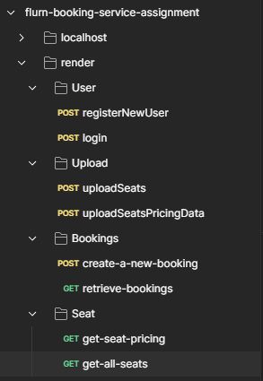

# Flurn Booking Service Assignment



## Objective

Build a Booking Service which allows users to choose seats and book.

## Assignment Specs:

- A list of seats and the seat class will be provided. Every seat class will have
  associated pricing with it. Pricing will be in the format of min price, max price and
  normal price.
- During the booking process when Seat is selected we should retrieve the pricing
  for that seat based on the number of bookings that have already happened for
  that seat class. If the seats in that particular class that was chosen are 60% full,
  then use the max price for all further seats booked. If the seats in the particular
- class that was chosen are 40% to 60% full, then use the normal price for the seat
  booking. If the seats of the particular class that was chosen for less than 40% then
  choose the min price.
- If there is no price available for that range, choose the next available price. Ex. If a
  seat class is only 30% full, but there is no min_pice for that class, use the
  normal_price.


## Tech. Stack Used:

- [MongoDB](https://www.mongodb.com/)
- [ExpressJS](https://expressjs.com/)
- [ReactJS](https://react.dev/)
- [NodeJS](https://nodejs.org/en/)

  

## How to install and run in yours local machine
### .env file
```javascript
PORT=4000
MONGODB_CONNECTION_STRING_LOCALHOST=mongodb://localhost:27017/flurn-booking-service-assignment
MONGODB_CONNECTION_STRING=<YoursMongoDBConnectionString>
JWT_PRIVATE_KEY=flurn-booking-service-assignment-private-key-created-on-14-aug-2024
USER_SESSION_EXPIRES_AFTER="1d"
```
Note: 
+ YoursMongoDBConnectionString : get yorus from [www.mongodb.com](https://www.mongodb.com/)


```bash
npm install
npm run start
```


## API Endpoints

### Download Postman endpoints file 
+ [postman-api-endpoints.json](flurn-booking-service-assignment-postman-endpoints.json)
### Server Base URL 
```bash
LOCALHOST=http://localhost:4000
RENDER=
```

## 1. User Endpoints
### 1.1 POST api/v1/user/registerNewUser
### Purpose:
Create new User Account.
### Request Body:
```javascript
JSON BODY
{
  "username": "sanket",
  "firstName": "john",
  "lastName": "doe",
  "email": "admin@21c.com",
  "mobile": "8278782787",
  "password": "admin123"
}

```
### Response Success:
```javascript
JSON
{
    "success": true,
    "Authorization": "Bearer JWT_TOKEN"
}
```
### 1.2 POST api/v1/user/login
### Purpose:
Sign In User
### Request Body:
```javascript
JSON BODY
{
  "usernameOrEmailOrMobile": "sanket",
  "password": "admin123"
}
```
### Response Success:
```javascript
JSON
{
    "success": true,
    "Authorization": "Bearer JWT_TOKEN"
}
```


## 2. Upload Endpoints
Note: 
+ [Download Seats.csv](SampleDataCsvFiles/Seats.csv)
+ [Download SeatsPricing.csv](SampleDataCsvFiles/SeatsPricing.csv)
  
### 2.1 POST api/v1/uploadDefaultDataIntoDbFromCsvFile/uploadSeats
### Purpose:
Upload Seats Sample data from seats.csv file into the Database
### Request Body:
```javascript
form-data
csvFile : seats.csv
```
### Response Success:
```javascript
JSON
{
    "success": true,
    "message": "Seats Data has been saved successfully into DB!"
}
```
### 2.2 POST api/v1/uploadDefaultDataIntoDbFromCsvFile/uploadSeatsPricingData
### Purpose:
Upload Seats Sample data from SeatsPricing.csv file into the Database
### Request Body:
```javascript
form-data
csvFile : SeatsPricing.csv
```
### Response Success:
```javascript
JSON
{
    "success": true,
    "message": "SeatsPricing Data has been saved successfully into DB!"
}
```

## 3. Bookings Endpoints
### 3.1 POST api/v1/uploadDefaultDataIntoDbFromCsvFile/uploadSeats
### Purpose:
Create Booking
- Create a booking for the selected seats.
- Accept an array of seat ids to be booked, name and phone number of the user.
- Create a booking if those seats are not previously booked. Return relevant error
- message if any seats chosen are already booked.
- Upon successful booking, return the booking ID, and the total amount of the
  booking.
### Request Body:
```javascript
HEADERS
"Authorization": "Bearer JWT_TOKEN"
BODY JSON
{
    "bookedSeatsIds": ["554266047-9", "006890170-4", "726092574-4"]
}

```
### Response Success:
```javascript
JSON
{
    "booking": {
        "bookedSeatsIds": [
            "554266047-9",
            "006890170-4",
            "726092574-4"
        ],
        "bookedByUserId": "66bf20e9219b1b63b5bafd13",
        "totalAmountForTheBooking": 635.8,
        "currencySymbol": "₹",
        "_id": "66bf2367219b1b63b5bb0124"
    }
}
```
### 3.2 GET api/v1/booking/retrieve-bookings
### Purpose:
Retrieve Bookings
- Return all bookings created by the user. The API should search by email or phone
  number. Any one has to be provided. Return error if no user identifier is provided.
### Request Body:
```javascript
HEADERS
"Authorization": "Bearer JWT_TOKEN"
BODY JSON
{
    "usernameOrEmailOrMobile": "admin@21c.com"   
}

```
### Response Success:
```javascript
JSON
{
    "bookings": [
        {
            "_id": "66bf2367219b1b63b5bb0124",
            "bookedSeatsIds": [
                "554266047-9",
                "006890170-4",
                "726092574-4"
            ],
            "bookedByUserId": "66bf20e9219b1b63b5bafd13",
            "totalAmountForTheBooking": 635.8,
            "currencySymbol": "₹",
            "__v": 0
        }
    ]
}
```

## 4. Seat Endpoints
### 4.1 GET api/v1/seat/get-seat-pricing
### Purpose:
 Get Seat pricing
- Return the seat details along with the pricing for the seat based on the class.

Note: The pricing should be returned based on the bookings previously made for
  that seat class.
  - Less than 40% of seats booked - use the min_price, if min_price is not
    available, use normal_price
  - 40% - 60% of seats booked - use the normal_price, if normal_price not
    available, use max_price
  - More than 60% of seats booked - use the max_price, if max_price is not
    available, use normal_price
### Request Body:
```javascript
HEADERS
"Authorization": "Bearer JWT_TOKEN"
BODY JSON
{
    "seatId": "726092574-4"    
}

```
### Response Success:
```javascript
JSON
{
    "seatPrice": 156.15,
    "seat_class": "D",
    "is_booked": true
}
```
### 4.2 GET api/v1/seat/get-all-seats
### Purpose:
Return all the seats, ordered by the seat class and also return a boolean is_booked
for every seat.
### Request Body:
```javascript
HEADERS
"Authorization": "Bearer JWT_TOKEN"
BODY 
NA
```
### Response Success:
```javascript
JSON
{
    "result": [
        {
            "_id": "66bf2213219b1b63b5bafd21",
            "seat_identifier": "704770716-6",
            "seat_class": "A",
            "is_booked": false,
            "createdAt": "2024-08-16T09:55:33.189Z",
            "updatedAt": "2024-08-16T09:55:33.189Z",
            "__v": 0
        },
        {
            "_id": "66bf2214219b1b63b5bafd39",
            "seat_identifier": "871034850-6",
            "seat_class": "A",
            "is_booked": false,
            "createdAt": "2024-08-16T09:55:33.190Z",
            "updatedAt": "2024-08-16T09:55:33.190Z",
            "__v": 0
        },
.
.
.
        {
            "_id": "66bf2214219b1b63b5baff05",
            "seat_identifier": "229209436-3",
            "seat_class": "J",
            "is_booked": false,
            "createdAt": "2024-08-16T09:55:33.489Z",
            "updatedAt": "2024-08-16T09:55:33.489Z",
            "__v": 0
        }
]
}
```
